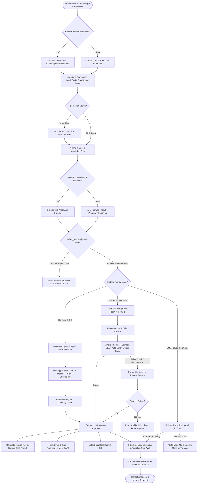
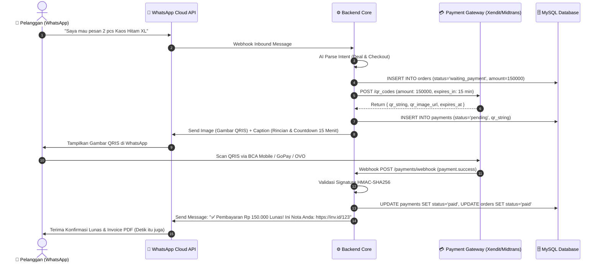
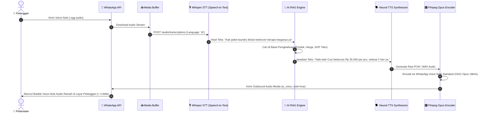
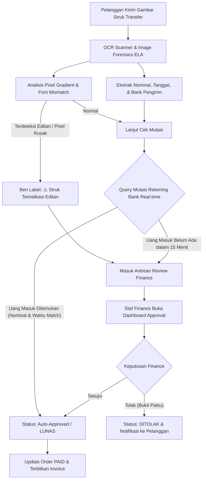
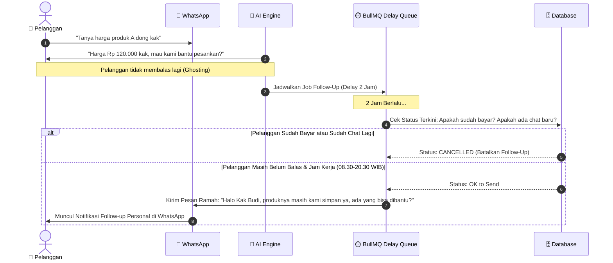
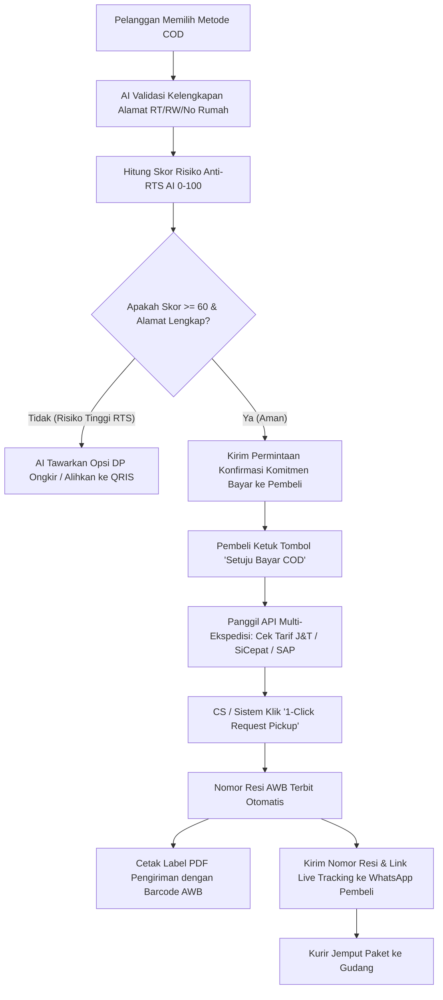
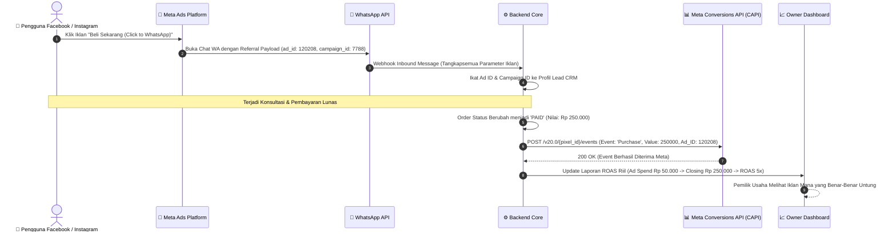
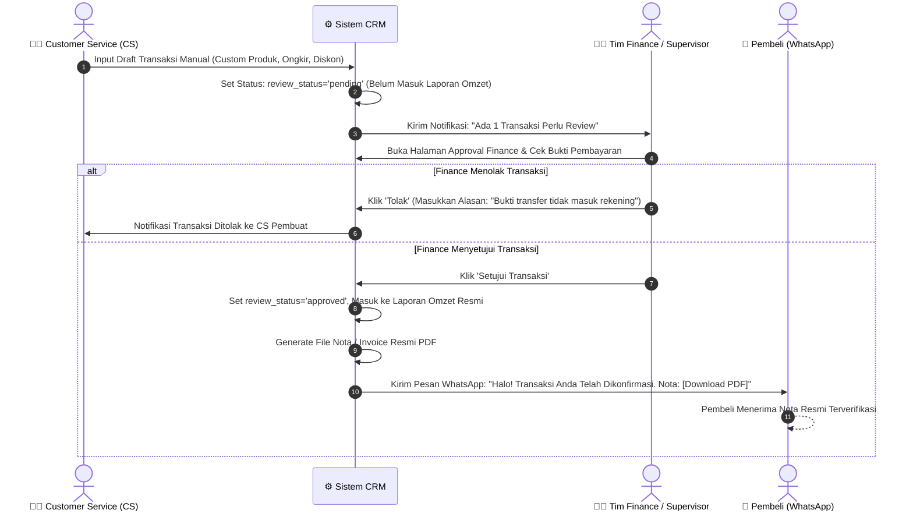

# 🗺️ APP FLOW & SYSTEM SEQUENCE DIAGRAMS
# Platform: Conversational AI Commerce & Smart CRM (Next-Gen)
**Versi:** 1.0.0  
**Status:** Visual Blueprint / Ready for Implementation  
**Dokumen Pendukung:** `docs/prd/PRD-AI-CONVERSATIONAL-COMMERCE-CRM.md`, `docs/prd/TRD-AI-CONVERSATIONAL-COMMERCE-CRM.md`, & `docs/prd/SCHEMA-AI-CONVERSATIONAL-COMMERCE-CRM.md`  
**Lokasi File:** `docs/prd/APPFLOW-AI-CONVERSATIONAL-COMMERCE-CRM.md`

---

## 1. Master End-to-End User Journey

Diagram alur menyeluruh mulai dari lead pertama kali masuk (via Iklan Meta atau WhatsApp organik) hingga barang terkirim dan komisi CS tercatat otomatis.



---

## 2. Alur Fitur 1: In-Chat Dynamic QRIS & Instant Checkout Flow

Menjelaskan interaksi checkout otomatis di WhatsApp tanpa transfer manual dan tanpa unggah struk.



---

## 3. Alur Fitur 2: AI Voice Note Inbound & Natural Voice Reply Flow

Menjelaskan pemrosesan pesan suara pembeli menjadi teks, konsultasi AI, hingga pembentukan suara balasan natural.



---

## 4. Alur Fitur 3: Deep Fraud Detection & Auto Bank Mutation Flow

Menjelaskan verifikasi keamanan struk transfer manual untuk mencegah penipuan struk palsu.



---

## 5. Alur Fitur 4: Proactive AI Sales & Abandonment Follow-Up Flow

Menjelaskan alur follow-up cerdas agar lead yang *ghosting* kembali merespons tanpa merasa di-spam.



---

## 6. Alur Fitur 5: COD Anti-RTS Risk Scoring & Shipping Booking Flow

Menjelaskan alur pesanan COD (Cash on Delivery) dengan validasi risiko retur dan booking kurir 1-klik.



---

## 7. Alur Fitur 6: Meta Ads (CTWA) Attribution & CAPI Event Sync Flow

Menjelaskan pelacakan omzet riil dari iklan Facebook/Instagram Ads (*Click to WhatsApp*) hingga sinkronisasi konversi balik ke Meta Ads Manager.



---

## 8. Alur Fitur 7: Multi-CS Lead Distribution & Commission Flow

Menjelaskan alur pembagian antrean kontak ke staf CS secara adil dan perhitungan komisi otomatis di akhir bulan.

```mermaid
flowchart TD
    A[Lead Baru Masuk ke WhatsApp] --> B{Apakah Lead Pernah Ditangani CS Tertentu? (Sticky Routing)}
    B -- Ya & CS Sedang Online --> C[Alokasikan Langsung ke CS Lama Tersebut]
    B -- Tidak / CS Lama Offline --> D[Cek Daftar CS yang Sedang Aktif / Shift Online]
    
    D --> E[Hitung Beban Chat Aktif & Closing Rate Tiap CS]
    E --> F[Pilih CS dengan Antrean Paling Sedikit & Performa Terbaik]
    F --> G[Tugaskan Lead ke CS Terpilih]
    G --> H[Kirim Notifikasi Push ke HP / Web Dashboard CS]
    
    H --> I[CS Melayani dan Melakukan Closing Penjualan]
    I --> J[Transaksi Ditandai LUNAS]
    J --> K[Sistem Otomatis Hitung Komisi CS Sesuai Aturan Master]
    K --> L[Catat ke Tabel cs_commission_ledgers]
    L --> M[Rekapitulasi Komisi Siap Dicairkan di Akhir Bulan]
```

---

## 9. Alur Maker-Checker Financial Approval & Invoice Dispatch

Menjelaskan alur pencatatan transaksi manual oleh CS, persetujuan oleh tim Finance, hingga pengiriman nota otomatis ke pembeli.


