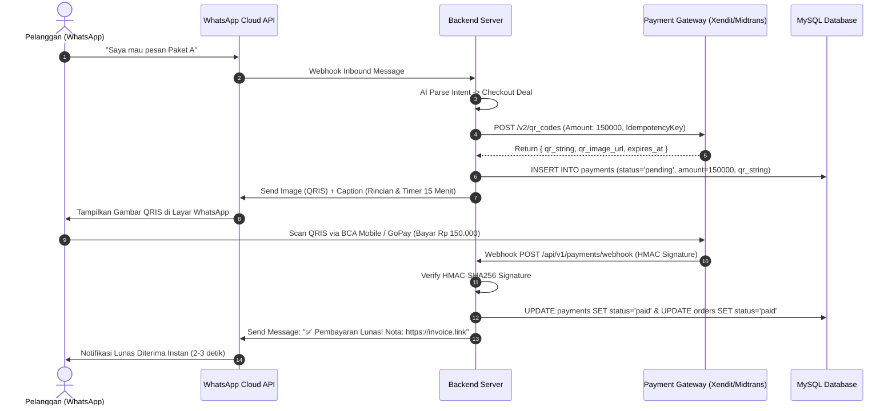

# 🛠️ TECHNICAL REQUIREMENT DOCUMENT (TRD)
# Platform: Conversational AI Commerce & Smart CRM (Next-Gen)
**Versi:** 1.0.0  
**Status:** Architecture Blueprint / Ready for Implementation  
**Dokumen Pendukung:** `docs/prd/PRD-AI-CONVERSATIONAL-COMMERCE-CRM.md`  
**Lokasi File:** `docs/prd/TRD-AI-CONVERSATIONAL-COMMERCE-CRM.md`

---

## 1. System Architecture Overview & Tech Stack

Sistem dibangun dengan arsitektur **Modular Monolith / Microservices-Ready** berbasis event-driven asynchronous queues untuk menjamin skalabilitas tinggi, pemrosesan chat real-time, dan isolasi data multi-tenant.

```
                              ┌────────────────────────────────────────────────────────┐
                              │            CLIENT APPLICATIONS & GATEWAYS              │
                              │  • WhatsApp Meta Cloud API / Baileys Gateway           │
                              │  • React 19 Frontend Web Dashboard (Tailwind CSS)     │
                              │  • Mobile App / PWA for CS & Supervisors               │
                              └───────────────────────────┬────────────────────────────┘
                                                          │ HTTPS / WSS
                                                          ▼
                              ┌────────────────────────────────────────────────────────┐
                              │           API GATEWAY & SECURITY MIDDLEWARE            │
                              │  • Reverse Proxy (Nginx / Cloudflare)                  │
                              │  • JWT Auth & Multi-Tenant Context Injection           │
                              │  • Rate Limiter & Idempotency Key Validator (Redis)    │
                              └───────────────────────────┬────────────────────────────┘
                                                          │
         ┌────────────────────────────────────────────────┼────────────────────────────────────────────────┐
         │                                                │                                                │
         ▼                                                ▼                                                ▼
┌───────────────────┐                          ┌────────────────────┐                           ┌───────────────────┐
│   CORE SERVICES   │                          │ WORKER QUEUE (REDIS│                           │    AI & VISION    │
│  • Lead & CRM     │                          │ • Outbound WA Queue│                           │  • RAG Vector Eng.│
│  • Master Data    │                          │ • STT / TTS Audio  │                           │  • Fast-Path Clas.│
│  • Order & Trans. │                          │ • Bank Recon Poller│                           │  • OCR Struk & ELA│
│  • Finance & Appr.│                          │ • Meta CAPI Batch  │                           │  • STT/TTS Engine │
└────────┬──────────┘                          └─────────┬──────────┘                           └────────┬──────────┘
         │                                               │                                               │
         └───────────────────────────────────────────────┼───────────────────────────────────────────────┘
                                                         │
                                                         ▼
                                      ┌──────────────────────────────────────┐
                                      │           STORAGE LAYER              │
                                      │  • MySQL 8.0 (Relational Master/Repl)│
                                      │  • Redis 7 (Cache, Sessions, Queues) │
                                      │  • S3 / Cloudflare R2 (Audio & Media)│
                                      │  • Vector Index (Chroma/pgvector)    │
                                      └──────────────────────────────────────┘
```

### 1.1 Technology Stack Matrix

| Komponen | Teknologi Pilihan | Alasan Pemilihan & Kegunaan |
|---|---|---|
| **Backend Core** | Node.js (Express / Fastify) + TypeScript | Event-driven, I/O non-blocking cepat untuk menangani ribuan chat concurrent. |
| **Database Utama** | MySQL 8.0 (InnoDB, `utf8mb4_unicode_ci`) | Transaksi ACID ketat untuk finansial, invoice, dan pesanan multi-tenant. |
| **Caching & Message Queue** | Redis 7.0 + BullMQ | Antrean pesan WhatsApp, worker transkripsi audio, rate-limiter, dan distributed lock. |
| **Media Storage** | Cloudflare R2 / AWS S3 Compatible | Penyimpanan file bukti transfer, file voice note `.ogg`, dan label resi pengiriman. |
| **Speech-to-Text (STT)** | OpenAI Whisper Large-v3 / Deepgram Nova-2 | Transkripsi audio bahasa Indonesia, slang, gaul, dan istilah e-commerce lokal. |
| **Text-to-Speech (TTS)** | ElevenLabs / Edge-TTS / Kokoro Indonesian | Sintesis suara customer service yang hangat, natural, dan berintonasi manusia. |
| **LLM & Semantic Engine** | NVIDIA NIM (Llama 3.1 70B) / DeepSeek V3 / GPT-4o-mini | Penalaran chat cerdas dengan cost efisien, didukung RAG embeddings terindeks. |
| **Vision OCR & Forensics** | Google Cloud Vision API / Sharp ELA Engine | Deteksi teks bukti transfer dan deteksi anomali pixel manipulasi Canva/Photoshop. |
| **Payment Aggregator** | Xendit / Midtrans / OY! Indonesia API | Dynamic QRIS, Virtual Account, Credit Card, dan notifikasi settlement real-time. |
| **Logistik Partner API** | Biteship / Shipper / Ekspedisi Direct API | Cek ongkir multi-kurir, generate AWB otomatis, dan tracking status kurir. |

---

## 2. Multi-Tenant Data Isolation & Security Architecture

### 2.1 Konteks Isolasi Tenant (`institution_id`)
Setiap data entitas (kontak, produk, invoice, rekening, log chat) terikat pada `institution_id`.
* **Guard Middleware**:
```typescript
// middleware/tenantContext.ts
export function tenantContext(req: Request, res: Response, next: NextFunction) {
  const institutionId = req.user?.institution_id;
  if (!institutionId) {
    return res.status(403).json({ success: false, message: "Konteks institusi tidak ditemukan." });
  }
  req.tenantId = institutionId;
  next();
}
```
* **Kueri SQL Wajib**: Seluruh kueri SELECT/UPDATE/DELETE **wajib** menyertakan parameter `WHERE institution_id = ?` dan tidak boleh mengandalkan ID entitas saja untuk mencegah *cross-tenant data leakage*.

### 2.2 Enkripsi Kredensial Sensitif (AES-256-GCM)
API Key Payment Gateway, Webhook Secret, dan Kredensial Bank dienkripsi sebelum disimpan ke database:
```typescript
// utils/crypto.ts
import crypto from "crypto";

const ALGORITHM = "aes-256-gcm";
const MASTER_KEY = Buffer.from(process.env.DB_ENCRYPTION_KEY!, "hex"); // 32 bytes

export function encryptSecret(plainText: string): string {
  const iv = crypto.randomBytes(12);
  const cipher = crypto.createCipheriv(ALGORITHM, MASTER_KEY, iv);
  let encrypted = cipher.update(plainText, "utf8", "hex");
  encrypted += cipher.final("hex");
  const authTag = cipher.getAuthTag().toString("hex");
  return `${iv.toString("hex")}:${authTag}:${encrypted}`;
}

export function decryptSecret(encryptedPayload: string): string {
  const [ivHex, authTagHex, cipherText] = encryptedPayload.split(":");
  const decipher = crypto.createDecipheriv(ALGORITHM, MASTER_KEY, Buffer.from(ivHex, "hex"));
  decipher.setAuthTag(Buffer.from(authTagHex, "hex"));
  let decrypted = decipher.update(cipherText, "hex", "utf8");
  decrypted += decipher.final("utf8");
  return decrypted;
}
```

---

## 3. Spesifikasi Arsitektur 7 Fitur Pembeda

```
         ┌──────────────────────────────────────────────────────────────────────────────────────────┐
         │                           ARSITEKTUR 7 MODUL TEKNIS UTAMA                                │
         └────────────────────────────────────────────┬─────────────────────────────────────────────┘
                                                      │
         ┌──────────────────────┬─────────────────────┼──────────────────────┬──────────────────────┐
         ▼                      ▼                     ▼                      ▼                      ▼
  [ 1. In-Chat QRIS ]    [ 2. Voice Audio ]    [ 3. Fraud & Bank ]   [ 4. AI Sales Engine ]  [ 5. Logistik/COD ]
   • Xendit/Midtrans API  • OGG Decoder Buffer  • ELA Image Analyzer  • Intent Abandonment   • Multi-Kurir API
   • Dynamic Payload Gen  • Whisper STT Engine  • Bank Scraper Worker • Cron Job Follow-up   • AWB Generator
   • HMAC Webhook Sec.    • Kokoro/Edge TTS     • Auto Match SQL      • Fatigue Control      • Anti-RTS Scorer
```

---

### 3.1 Modul 1: In-Chat Dynamic QRIS & Instant Payment Engine

#### A. Alur Kerja (Sequence Diagram)


#### B. Spesifikasi Endpoint API Payment
* **`POST /api/v1/payments/qris`**: Membuat Dynamic QRIS tagihan instan.
  * **Headers**: `Authorization: Bearer <jwt>`, `X-Idempotency-Key: <uuid>`
  * **Request Payload**:
    ```json
    {
      "order_id": "ORD-2026-0829-001",
      "amount": 150000,
      "customer_phone": "6281234567890",
      "customer_name": "Budi Santoso",
      "expires_in_minutes": 15
    }
    ```
  * **Response (201 Created)**:
    ```json
    {
      "success": true,
      "data": {
        "payment_id": "PAY-QRIS-99881122",
        "qr_string": "00020101021226590014ID.LINKAJA.WWW01189360091100223344555204581253033605802ID5914TOKO_BERKAH6007JAKARTA61051234062070703A016304C92B",
        "qr_image_url": "https://api.gateway.com/qr/PAY-QRIS-99881122.png",
        "amount": 150000,
        "fee": 1050,
        "status": "pending",
        "expires_at": "2026-08-29T01:30:00.000Z"
      }
    }
    ```

* **`POST /api/v1/payments/webhook`**: Handler notifikasi webhook payment gateway.
  * **Headers**: `x-callback-token` atau `x-hub-signature-256`
  * **Verifikasi Keamanan**:
    ```typescript
    const incomingSignature = req.headers["x-signature"];
    const computedSignature = crypto
      .createHmac("sha256", WEBHOOK_SECRET)
      .update(JSON.stringify(req.body))
      .digest("hex");

    if (incomingSignature !== computedSignature) {
      return res.status(401).json({ error: "Invalid signature digest" });
    }
    ```

---

### 3.2 Modul 2: AI Voice Note Engine (Audio STT & TTS Pipeline)

#### A. Arsitektur Pemrosesan Audio
```
[ Inbound WhatsApp .ogg Voice Note ] 
                │
                ▼
[ Webhook Ingestion & Media Buffer Download ]
                │
                ▼
[ BullMQ Worker Queue: 'voice-transcription' ]
                │
                ▼
[ Whisper Large-v3 API (STT Language: 'id') ] ──► Transkripsi Teks Hasil: "Halo kak mau tanya paket laundry bedcover berapa ya"
                │
                ▼
[ AI RAG Brain (Katalog Produk / FAQ) ] ────────► Jawaban Teks: "Halo! Paket laundry bedcover Rp 35.000 per pcs, selesai 2 hari kak."
                │
                ▼
[ Neural TTS Synthesizer (Kokoro / Edge-TTS) ] ─► Generate Audio Buffer (.wav)
                │
                ▼
[ Ffmpeg Encoder (.wav -> .ogg Opus 16kHz) ] ──► Voice Note Compatible Buffer
                │
                ▼
[ WhatsApp Cloud API Outbound Media Dispatch ] ─► Terkirim sebagai Voice Note ke WhatsApp Pelanggan (< 4 detik)
```

#### B. Spesifikasi Parameter STT & TTS
* **Audio Transkrip Payload**:
  ```json
  {
    "model": "whisper-large-v3",
    "language": "id",
    "response_format": "verbose_json",
    "temperature": 0.0,
    "prompt": "Transkripsi obrolan toko online bahasa Indonesia, istilah: ongkir, transfer, cod, ready, resi, bayar."
  }
  ```
* **Audio Synthesis Parameters**:
  * Voice ID: `id-ID-GadisNeural` atau `id-ID-ArdiNeural`
  * Sample Rate: `16000 Hz` (standar WhatsApp Opus audio)
  * Bitrate: `32 kbps` (ringan dan hemat kuota data pelanggan)

---

### 3.3 Modul 3: Deep AI Fraud Detection & Auto Bank Mutation Reconciliation

#### A. Pipeline Deteksi Struk Palsu (Image Forensics & OCR)
1. **Analisis Error Level (ELA - Error Level Analysis)**:
   * Mengompresi ulang gambar dengan kualitas 90% dan menghitung perbedaan selisih matriks pixel (*pixel error gradient*).
   * Font editan yang ditempelkan di atas gambar screenshot akan menghasilkan noise pixel yang tidak rata (*highlighted bright pixels*).
2. **Font & Layout Pattern Matching**:
   * Membandingkan koordinat x, y font nominal dengan koordinat baku template aplikasi m-banking resmi (BCA Mobile, Livin Mandiri, BRImo).

```typescript
// services/fraudDetector.ts
export interface FraudCheckResult {
  is_suspicious: boolean;
  confidence_score: number; // 0 - 100
  fraud_reasons: string[];
  extracted_data: {
    bank_name: string;
    amount: number;
    transaction_time: string;
    sender_name: string;
    recipient_account: string;
  };
}
```

#### B. Worker Poller Mutasi Rekening Bank
* **Worker Cron Interval**: Berjalan setiap 60 detik untuk mengecek transaksi pending.
* **Kueri Rekonsiliasi Otomatis**:
  ```sql
  SELECT bm.id, bm.amount, bm.transaction_date, o.id as order_id
  FROM bank_mutations bm
  JOIN orders o ON o.institution_id = bm.institution_id
  WHERE o.status = 'waiting_payment'
    AND bm.is_reconciled = 0
    AND bm.type = 'CR' -- Uang Masuk
    AND bm.amount = o.total_amount
    AND bm.transaction_date >= o.created_at
    AND bm.transaction_date <= DATE_ADD(o.created_at, INTERVAL 24 HOUR)
  LIMIT 10;
  ```
* Jika ditemukan match $\rightarrow$ Transaksi otomatis di-mark `PAID`, mutasi di-mark `is_reconciled = 1`, dan notifikasi dikirimkan ke CS & Buyer.

---

### 3.4 Modul 4: Proactive AI Sales & Follow-Up Engine

#### A. State Machine Alur Follow-Up
```
[ Lead Tanya Produk ] ──► [ AI Kasih Info / Rekening ] ──► (Menunggu Pembayaran)
                                                                 │
                                         ┌───────────────────────┴───────────────────────┐
                                         │ (Jika tidak bayar dalam 2 Jam)                │ (Jika Lunas)
                                         ▼                                               ▼
                         [ Follow-up 1: Bantuan Bayar ]                          [ State: CLOSED WON ]
                                         │
                         ┌───────────────┴───────────────┐
                         │ (Jika 24 Jam belum balas)     │ (Jika Balas Beli)
                         ▼                               ▼
               [ Follow-up 2: Promo Terbatas ]    [ Kirim QRIS Baru ]
                         │
                         ▼ (Jika tetap tidak balas / menolak)
               [ State: CLOSED LOST (Stop Follow-up) ]
```

#### B. Queue Schema & Anti-Fatigue Filter
* **Job Queue Parameter**:
  ```json
  {
    "queue": "proactive-sales-followup",
    "job_id": "FU-LEAD-789-STEP-1",
    "lead_id": 789,
    "step": 1,
    "delay_ms": 7200000, // 2 Jam
    "max_attempts": 2
  }
  ```
* **Guard Check Sebelum Kirim Pesan**:
  1. Apakah pelanggan sudah melakukan pembayaran? *(Jika ya $\rightarrow$ batalkan job)*.
  2. Apakah pelanggan sudah mengirim pesan lain dalam 30 menit terakhir? *(Jika ya $\rightarrow$ batalkan job untuk hindari spam)*.
  3. Apakah waktu sekarang di luar rentang jam 08.30 – 20.30 WIB? *(Jika ya $\rightarrow$ tunda eksekusi ke jam 08.30 WIB besok pagi)*.

---

### 3.5 Modul 5: COD Anti-RTS Protection & Shipping Aggregator

#### A. Algoritma Kalkulasi Skor Risiko COD (Anti-RTS Score 0–100)
```typescript
export function calculateCodRiskScore(params: {
  phoneHistoryOrders: number;
  phoneHistoryRtsCount: number;
  isAddressDetailed: boolean; // memiliki RT/RW/No Rumah
  isCityCoveredByCourierCod: boolean;
}): { score: number; is_safe_for_cod: boolean } {
  let score = 100;

  // Penalti riwayat retur masa lalu
  if (params.phoneHistoryRtsCount > 0) {
    score -= params.phoneHistoryRtsCount * 35;
  }

  // Penalti alamat tidak lengkap
  if (!params.isAddressDetailed) {
    score -= 25;
  }

  // Penalti jika area luar pulau / kurir sering gagal kirim
  if (!params.isCityCoveredByCourierCod) {
    score -= 30;
  }

  return {
    score: Math.max(0, score),
    is_safe_for_cod: score >= 60,
  };
}
```

#### B. Endpoint Cek Ongkir Multi-Ekspedisi (`POST /api/v1/shipping/rates`)
* **Request Payload**:
  ```json
  {
    "origin_postal_code": "12340",
    "destination_postal_code": "60293",
    "weight_in_grams": 1200,
    "items_value": 250000,
    "is_cod": true
  }
  ```
* **Response Payload**:
  ```json
  {
    "success": true,
    "data": [
      {
        "courier_code": "jnt",
        "courier_name": "J&T Express",
        "service": "EZ",
        "rate": 22000,
        "etd": "1-2 hari",
        "cashback_amount": 4400, // 20% komisi untuk platform/seller
        "cod_available": true
      },
      {
        "courier_code": "sicepat",
        "courier_name": "SiCepat",
        "service": "SIUNT",
        "rate": 20000,
        "etd": "1-2 hari",
        "cashback_amount": 3600,
        "cod_available": true
      }
    ]
  }
  ```

---

### 3.6 Modul 6: Meta Ads (CTWA) Attribution & Offline CAPI Tracker

#### A. Arsitektur Penangkapan Parameter & Sync CAPI
1. **Penerimaan Inbound Chat**:
   * Saat user klik iklan Facebook/Instagram Ads $\rightarrow$ WhatsApp webhook mengirim field `referral`:
     ```json
     {
       "referral": {
         "source_type": "ad",
         "source_id": "1202081122334455",
         "source_url": "https://fb.me/xxxx",
         "headline": "Diskon 50% Baju Muslim",
         "body": "Dapatkan penawaran terbatas hari ini",
         "media_type": "image"
       }
     }
     ```
   * Backend mengaitkan `source_id` (Ad ID) ke tabel `leads` kolom `meta_ad_id`.

2. **Pengiriman Event Offline Conversion ke Meta Graph API**:
   * Endpoint: `POST https://graph.facebook.com/v20.0/{pixel_id}/events`
   * Payload:
     ```json
     {
       "data": [
         {
           "event_name": "Purchase",
           "event_time": 1724890000,
           "action_source": "system_generated",
           "user_data": {
             "ph": ["e3b0c44298fc1c149afbf4c8996fb92427ae41e4649b934ca495991b7852b855"]
           },
           "custom_data": {
             "currency": "IDR",
             "value": 250000,
             "order_id": "ORD-2026-0829-001",
             "ad_id": "1202081122334455"
           }
         }
       ],
       "access_token": "<META_SYSTEM_USER_ACCESS_TOKEN>"
     }
     ```

---

### 3.7 Modul 7: Smart Lead Distribution & CS Commission Tracker

#### A. Algoritma Pembagian Lead (Weighted Round-Robin with Sticky Routing)
```typescript
export async function assignLeadToNextCs(institutionId: number, leadId: number): Promise<number> {
  // 1. Sticky Routing Check: Apakah lead pernah punya CS sebelumnya?
  const previousCs = await db.query(
    `SELECT cs_user_id FROM orders WHERE lead_id = ? AND institution_id = ? ORDER BY id DESC LIMIT 1`,
    [leadId, institutionId]
  );
  if (previousCs.length > 0 && previousCs[0].cs_user_id) {
    const isOnline = await checkCsOnlineStatus(previousCs[0].cs_user_id);
    if (isOnline) return previousCs[0].cs_user_id;
  }

  // 2. Active Online CS Pool
  const onlineCsList = await db.query(
    `SELECT u.id, u.closing_rate_percent, COUNT(l.id) as active_chat_count
     FROM users u
     LEFT JOIN leads l ON l.assigned_cs_id = u.id AND l.status = 'in_progress'
     WHERE u.institution_id = ? AND u.role = 'cs' AND u.is_active = 1 AND u.is_online = 1
     GROUP BY u.id
     ORDER BY active_chat_count ASC, u.closing_rate_percent DESC`,
    [institutionId]
  );

  if (onlineCsList.length === 0) {
    // Fallback: Assign ke default supervisor/inbox antrean umum
    return getDefaultSupervisorId(institutionId);
  }

  const selectedCsId = onlineCsList[0].id;
  await db.query(`UPDATE leads SET assigned_cs_id = ? WHERE id = ?`, [selectedCsId, leadId]);
  return selectedCsId;
}
```

---

## 4. Background Job Queues (BullMQ / Redis Engine)

Sistem memisahkan beban kerja berat ke dalam 5 antrean asynchronous terdedikasi:

| Nama Queue | Concurrency | Retry Limit | Deskripsi Tugas |
|---|:---:|:---:|---|
| `whatsapp-outbound` | 25 | 3x (Backoff 2s) | Mengirim pesan teks, gambar QRIS, dan invoice ke WhatsApp dengan jeda aman anti-banned. |
| `voice-processing` | 10 | 2x | Worker transkripsi audio Whisper dan rendering file suara balasan OGG Opus. |
| `fraud-ocr-scanner` | 15 | 2x | Pemrosesan OCR bukti transfer dan analisis ELA forensik gambar. |
| `bank-reconciliation` | 5 | 3x | Polling mutasi rekening bank dan auto-matching transaksi masuk. |
| `meta-capi-dispatcher` | 10 | 5x (Backoff 5s) | Batching pengiriman offline event purchase ke Meta Conversions API. |

---

## 5. Non-Functional & Reliability Engineering

1. **Idempotency Control**:
   * Setiap request pembuatan pembayaran atau penagihan wajib menyertakan header `X-Idempotency-Key`.
   * Redis menyimpan key dengan TTL 24 jam: `SETNX idempotency:{key} {response_payload}`.
2. **Database Connection Pooling**:
   * Menggunakan pool connection `mysql2/promise` dengan konfigurasi:
     * `connectionLimit: 50`
     * `queueLimit: 0`
     * `waitForConnections: true`
     * `timezone: '+07:00'` (WIB Jakarta Standard).
3. **Graceful Shutdown & Zero Data Loss**:
   * Menangani sinyal `SIGTERM` dan `SIGINT` dengan menunggu antrean job BullMQ yang sedang berjalan selesai sebelum mematikan koneksi database.
